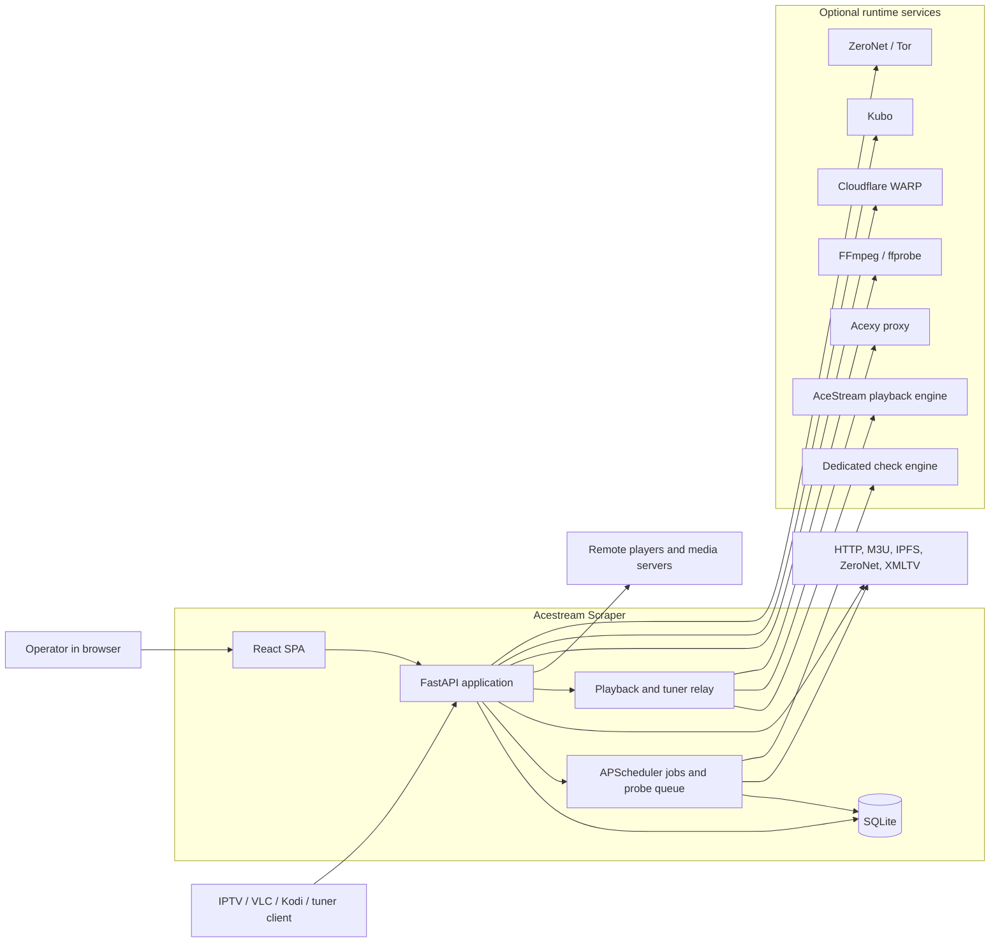
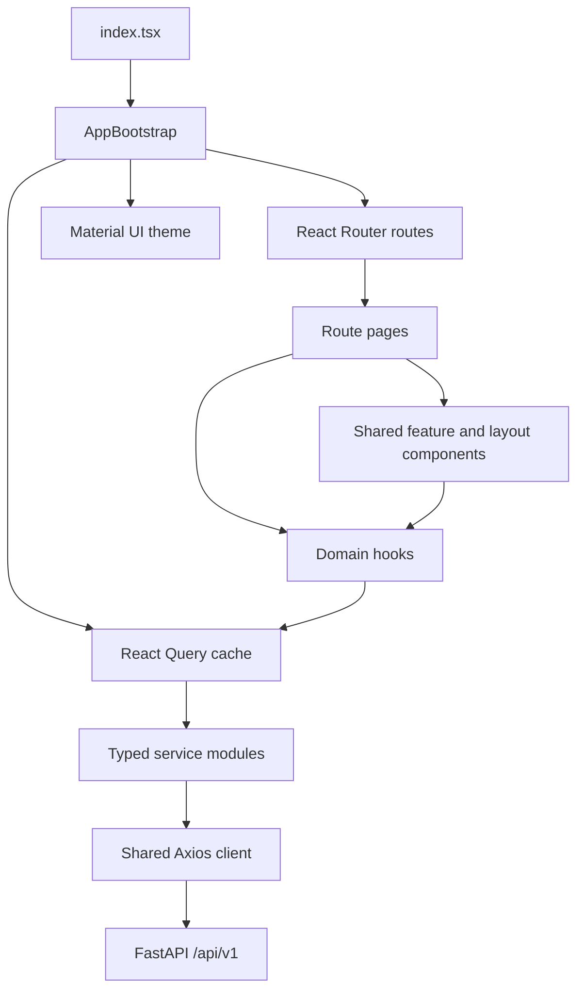
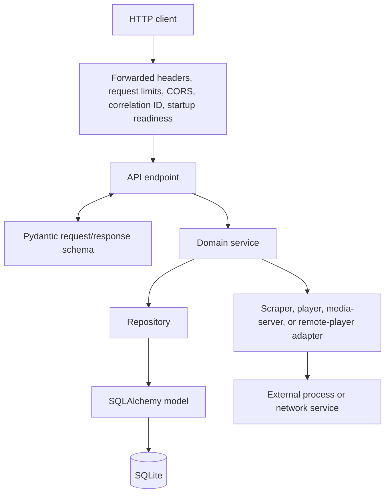
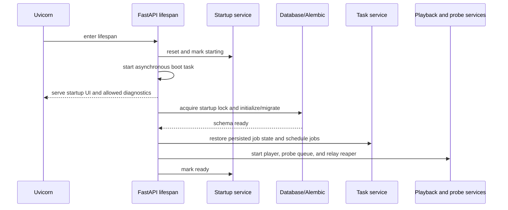
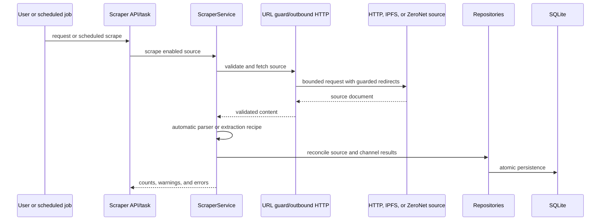

# Acestream Scraper Architecture

This document describes the current v2 application architecture on the
`develop` branch. It is a map for contributors: which processes exist, where
responsibilities live, how data moves, and which boundaries must remain intact.

The canonical application roots are `backend/` and `frontend/`. The root
`pyproject.toml` and retired Flask-era paths are legacy metadata, not the runtime
architecture.

## 1. System context

Acestream Scraper is a self-hosted media catalogue and operations application. It
collects channel data from HTTP, IPFS, and ZeroNet sources; enriches it with EPG
data; checks stream health; generates M3U/XMLTV outputs; and coordinates local or
external playback services.

## 2. Runtime topology

The production image is a single application container assembled by the root
multi-stage `Dockerfile`:

- Vite builds the React frontend.
- FastAPI serves `/api/v1`, public player-compatible routes, and the compiled SPA
  from one origin.
- SQLite and operator configuration live under the mounted configuration path.
- `entrypoint.sh` supervises enabled companion processes and then starts Uvicorn
  on port 8000.
- `tini` is PID 1 and forwards signals; the container health check calls
  `healthcheck.sh`.

Four image flavors select installed binaries:

| Flavor | Web app | AceStream | Acexy |
| --- | --- | --- | --- |
| `scraper` | Yes | No | No |
| `scraper-acestream` | Yes | Yes | No |
| `scraper-acexy` | Yes | No | Yes |
| `scraper-acestream-acexy` | Yes | Yes | Yes |

`latest` has the same payload as `scraper-acestream-acexy`. Runtime environment
flags decide whether installed optional services start. Kubo, ZeroNet, WARP, Tor,
and FFmpeg have their own platform and enablement constraints; consult
`docs/architecture/deployment.md` and the operator guides before changing them.

The supported image matrix is derived from the Docker manifests and CI scripts,
not from assumptions in application code. Current targets include amd64, arm64,
and arm/v7 with feature-specific limitations.

## 3. Frontend architecture

The frontend is a React 18 and TypeScript SPA built with Vite and Material UI.

### Responsibilities

- `bootstrap/AppBootstrap.tsx` owns the theme provider, theme preference, router,
  startup gate, and the process-wide React Query client.
- `App.tsx` defines route composition and legacy UI redirects.
- `pages/` contains route-level orchestration.
- `components/` contains reusable layout, state, inventory, EPG, player, and
  integration UI.
- `hooks/` combines query state and page-facing operations.
- `services/` is the HTTP boundary. All requests share `apiClient`, which selects
  the runtime base URL, attaches the optional `X-Api-Token`, and normalizes API
  errors.
- `types/api-generated.ts` is generated from `backend/openapi.json`; handwritten
  feature types should not duplicate generated API contracts.
- `recipes/` contains the extraction recipe engine and the standalone public
  helper build.

Server state belongs in React Query. Local component state is appropriate for
ephemeral UI decisions such as open dialogs, draft form values, and selected
rows. Avoid creating a second application-wide server cache.

## 4. Backend architecture

The backend is a FastAPI application using Pydantic v2, SQLAlchemy 2.x, Alembic,
and APScheduler.

### Layers and dependency direction

| Layer | Location | Responsibility |
| --- | --- | --- |
| HTTP entry | `backend/main.py` | Lifespan, middleware, route registration, SPA and compatibility routes |
| API | `backend/app/api/` | Transport validation, dependencies, status codes, DTO mapping |
| Schemas | `backend/app/schemas/` | Pydantic request and response contracts |
| Services | `backend/app/services/` | Domain behavior, orchestration, external integrations |
| Repositories | `backend/app/repositories/` | Database queries and persistence operations |
| Models | `backend/app/models/` | SQLAlchemy persistence model |
| Scrapers/adapters | `backend/app/scrapers/` and service subpackages | Protocol-specific access behind common interfaces |
| Tasks | `backend/app/tasks/` | Scheduled job entry points |
| Migrations | `backend/migrations/` | Ordered, durable schema evolution |

Endpoints should remain thin. Business decisions belong in services, while
database-only access belongs in repositories. Background and process-wide
services may open their own short-lived `SessionLocal` because they do not run in
a request dependency; they must close it deterministically.

### API surface

The versioned router is mounted at `/api/v1` and groups channels, TV channels,
scrapers, EPG, playlists, search, configuration, WARP, URLs, AceStream, statistics,
activity, background tasks, streams, base URLs, system operations, player,
remote players, media servers, tuner settings, and startup state.

Additional routes exist for protocol compatibility:

- M3U and XMLTV URLs consumed by players;
- legacy v1 playlist URLs;
- HDHomeRun-style tuner discovery, lineup, and stream routes;
- SPA fallback routes.

The optional API token protects management access. Tuner clients use a separate
network allow-list because common tuner protocols cannot supply the application
token. Forwarded headers are accepted only from explicitly trusted peers.

## 5. Startup and process lifecycle

Startup is deliberately observable and recoverable rather than blocking the
entire HTTP process.

While startup is incomplete, middleware permits the startup UI, static assets,
startup status, and bounded diagnostics while returning `503` for unavailable
operations. Database work runs off the event loop and is protected by a startup
lock. Shutdown waits for in-flight startup work, stops background services, and
releases the lock.

## 6. Persistence and migrations

SQLite is the canonical application store. The main persistence domains are:

- scraped source definitions and imported AceStream channels;
- curated TV channels and their stream associations;
- EPG sources, channels, programs, and matching rules;
- settings, dashboard configuration, and public base URLs;
- remote players and media-server integrations;
- activity history and scheduled-task state.

Alembic migrations are the only production schema evolution mechanism. Do not
use `Base.metadata.create_all()` as a replacement for migrations. A schema change
requires:

1. an updated SQLAlchemy model;
2. an Alembic revision with a safe upgrade path;
3. migration-path and schema-parity verification;
4. updated Pydantic/OpenAPI contracts when the change is externally visible;
5. regenerated frontend API types when the contract changes.

Use timezone-aware datetimes. Persisted task state lets interrupted scheduled work
be identified during restart rather than silently reported as running.

## 7. Core data flows

### 7.1 Source ingestion

User-controlled destinations must pass the shared outbound URL guard. Redirects
are validated hop by hop, DNS answers are pinned, and cloud metadata addresses
remain denied. Extraction recipe regex work runs in a bounded worker.

### 7.2 EPG lifecycle

EPG sources are fetched and parsed into channels and programs. Matching services
link EPG identities to curated TV channels using explicit rules and analysis
flows. XMLTV exports and the live guide read the same persisted model. Cleanup and
refresh are scheduled independently so large imports do not become unbounded
request-startup work.

### 7.3 Stream verification

Catalogue presence does not imply availability. Status checks use the shared
priority probe queue and distinguish:

- engine/network identification;
- verified audio/video delivery;
- skipped checks;
- timeouts and engine failures;
- explicit ID-not-found results.

Checks preserve prior results when a configured dedicated checker is unavailable.
They also respect process-wide playback ownership so a probe cannot stop an
active viewer's source.

### 7.4 Playback and tuner relay

Browser playback and tuner endpoints create or join managed relay sessions.
Direct mode talks to an AceStream engine; Acexy mode reads the proxy stream and
does not issue direct engine lifecycle commands. FFmpeg may produce browser HLS
or experimental tuner normalization. Session ownership, reference counting,
capacity limits, cleanup, and graceful shutdown are process-wide concerns owned
by the playback services.

Remote players receive a playable URL or command through driver adapters. Media
servers use their own adapters for discovery, validation, and synchronization.

## 8. Background work

`TaskService` wraps APScheduler and coordinates a FIFO execution model with
persisted status. Recurring jobs include:

| Job | Default cadence or source |
| --- | --- |
| Activity-log cleanup | Daily |
| EPG refresh | Configured interval; default 6 hours |
| EPG program cleanup | Hourly |
| URL scraping | Configured interval; default 24 hours |
| Channel cleanup | Daily |
| Channel status | Configured interval; default 60 minutes |
| Media-server sync | Every 10 minutes |

Manual and scheduled work share concurrency guards. Run-now requests do not
duplicate already running or waiting jobs. Stream probes use an additional
priority queue so interactive playback-related checks can take precedence over
bulk scheduled checks without interrupting cleanup.

## 9. Security and trust boundaries

The main trust boundaries are:

1. **Browser/API boundary.** Optional API-token enforcement, typed validation,
   bounded request bodies, and correlation IDs.
2. **Reverse-proxy boundary.** Forwarded identity is accepted only from configured
   trusted peers.
3. **User URL boundary.** Shared SSRF protection, redirect validation, pinned DNS,
   timeouts, and narrowly scoped gateway exemptions.
4. **Tuner boundary.** Token-free protocol routes are restricted by allowed
   networks.
5. **Process boundary.** Optional services are controlled through bounded command
   and health interfaces; credentials and logs are redacted from diagnostics.
6. **CI boundary.** Fork validation runs without repository credentials or the
   Docker socket; publishing occurs only in trusted Jenkins jobs.

Never place secrets, infrastructure coordinates, tokens, or mounted host paths in
tracked diagnostics or documentation.

## 10. Build, test, and delivery architecture

Jenkins is the application validation and release system.

- Feature and hotfix pull requests target `develop`.
- PR validation is credential-free for forked code and uses target-owned CI
  selection logic.
- Trusted `develop` validation may publish only floating `develop` image tags.
- Only `develop` opens a release PR to `main`.
- Version tags and `latest` promotion are manual release operations.
- Docker-heavy pipelines share one FIFO lock so builds do not prune or interfere
  with each other.

Test ownership is split by layer:

- `backend/tests/`: pytest unit, integration, migration, contract, Docker, and
  architecture checks;
- `frontend/src/__tests__/`: Jest and React Testing Library;
- `e2e/`: Playwright/Firefox journeys against a real built stack;
- `scripts/ci/`: cross-stack, packaging, manifest, publication, and policy gates.

## 11. Architectural invariants

Changes must preserve these rules:

- `backend/` and `frontend/` remain the only canonical application roots.
- Endpoint modules stay thin; services own behavior; repositories own DB access.
- API changes update schemas, OpenAPI, generated TypeScript, consumers, and tests
  together.
- Production schema changes always use Alembic.
- Blocking I/O and large migrations do not run on the async event loop.
- User-supplied URLs always use the shared guarded outbound HTTP path.
- Optional service failure does not silently change playback/checking mode.
- Playback ownership is released exactly once and probes do not stop live streams.
- All supported image flavors and CPU architectures remain explicit in manifests
  and validation.
- The frontend remains TypeScript-only and uses the shared semantic theme.
- Release publishing, `latest` promotion, and protected-branch changes stay
  deliberate operator actions.

## 12. Where to extend the system

| Change | Primary extension points |
| --- | --- |
| New management API | schema -> service -> repository -> endpoint -> OpenAPI/types |
| New source protocol | scraper adapter, URL model/guard policy, service, tests |
| New scheduled job | task entry point, `TaskService`, persisted state, UI status |
| New remote player | driver under `services/remote_players/` and API/UI integration |
| New media server | adapter under `services/media_servers/` and API/UI integration |
| New page | route, page, domain hook/service, shared layout primitives |
| New persistent field | model, Alembic migration, repository, schema, generated types |
| New image capability | Docker stage/flavor, entrypoint supervision, health, manifest, docs, CI |

Before changing cross-cutting runtime behavior, also read `AGENTS.md`, the
applicable layered `AGENTS.md`, `docs/architecture/deployment.md`, and the nearest
operator runbook.
